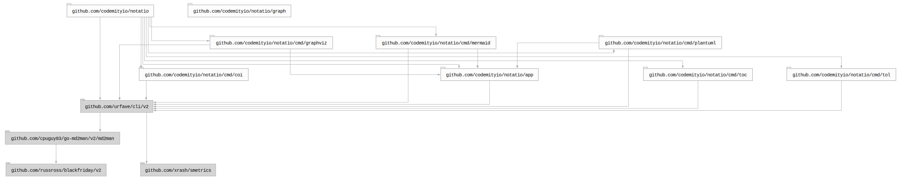

# 


## Table of contents

- [Summary](#summary)
- [Installation](#installation)
- [Usage](#usage)
  - [Manual](#manual)
  - [Subcommands](#subcommands)
  - [Docker](#docker)
- [Development](#development)
- [Packages](#packages)
- [Third party software](#third-party-software)
- [Dependencies](#dependencies)
  - [Graph](#graph)
  - [Licenses](#licenses)
- [License](#license)

## Summary

A tool designed to streamline working with documentation and diagrams.

## Installation

To install the package, run `make install` (directly from the repository clone) or use
`go install github.com/codemityio/notatio@latest`.

> Some of the tools depend on additional commands such as `dot`, `mmdc`, `java` or `chromium-browser`. If any of these
> are missing, you will be notified when using the tools. For the most seamless experience, we recommend using the
> containerized version of this tool.

## Usage

Once installed, use the `notatio` command to get started.

### Manual

``` bash
$ notatio --help
NAME:
   notatio - A new cli application

USAGE:
   notatio [global options] command [command options]

VERSION:
   latest

DESCRIPTION:
   A tool designed to streamline working with documentation and diagrams.

AUTHOR:
   codemityio

COMMANDS:
   coi       
   fs        
   graphviz  
   mermaid   
   plantuml  
   toc       
   tol       
   help, h   Shows a list of commands or help for one command

GLOBAL OPTIONS:
   --help, -h     show help
   --version, -v  print the version

COPYRIGHT:
   codemityio
```

### Subcommands

- [`coi`](cmd/coi/README.md) - A simple tool to generate document sections with provided command output.
- [`fs`](cmd/fs/README.md) - A tool for scanning and analysing the file system.
- [`graphviz`](cmd/graphviz/README.md) - A CLI tool that wraps <https://gitlab.com/graphviz/graphviz> to convert
  `dot`/`gv` files to `svg`/`png` images.
- [`mermaid`](cmd/mermaid/README.md) - A CLI tool that wraps <https://github.com/mermaid-js/mermaid-cli> to convert
  `mmd` files to `svg`/`png` images.
- [`plantuml`](cmd/plantuml/README.md) - A CLI tool that wraps <https://github.com/plantuml/plantuml> to convert `puml`
  files to `svg`/`png` images.
- [`toc`](cmd/toc/README.md) - A tool to generate table of contents section within a **Markdown** file from a list of
  paths or headers found in a document.
- [`tol`](cmd/tol/README.md) - A simple tool to generate a table of licenses from
  [`go-licenses`](https://github.com/google/go-licenses) output.

### Docker

``` bash
$ docker run codemityio/notatio
```

## Development

To work with the codebase, use `make` command as the primary entry point for all project tools.

Use the arrow keys `↓ ↑ → ←` to navigate the options, and press `/` to toggle search.

> Run `make cmd COMMAND="make check"` before raising a PR to ensure all checks pass in the CI environment.

## Packages

## Third party software

The **Docker** image is based on <https://github.com/codemityio/dbi> which includes the following third-party
components.

- **PlantUML** (<https://plantuml.com>) — licensed under GPL v3
  <https://github.com/plantuml/plantuml/blob/master/license.txt> - no modifications made.

- **Graphviz** (<https://graphviz.org>) — licensed under EPL v1.0
  <https://gitlab.com/graphviz/graphviz/-/blob/main/LICENSE> - no modifications made.

- **Mermaid** (<https://mermaid.js.org>) — licensed under MIT. Copyright (c) 2014-2024 Knut Sveidqvist - no
  modifications made.

## Dependencies

### Graph



### Licenses

| Package                                 | Licence                                                         | Type         |
|-----------------------------------------|-----------------------------------------------------------------|--------------|
| github.com/cpuguy83/go-md2man/v2/md2man | https://github.com/cpuguy83/go-md2man/blob/v2.0.7/LICENSE.md    | MIT          |
| github.com/russross/blackfriday/v2      | https://github.com/russross/blackfriday/blob/v2.1.0/LICENSE.txt | BSD-2-Clause |
| github.com/urfave/cli/v2                | https://github.com/urfave/cli/blob/v2.27.7/LICENSE              | MIT          |
| github.com/xrash/smetrics               | https://github.com/xrash/smetrics/blob/686a1a2994c1/LICENSE     | MIT          |
| golang.org/x/sys/unix                   | https://cs.opensource.google/go/x/sys/+/v0.43.0:LICENSE         | BSD-3-Clause |

## License

This project is licensed under the MIT License. See the [LICENSE](LICENSE) file for details.
